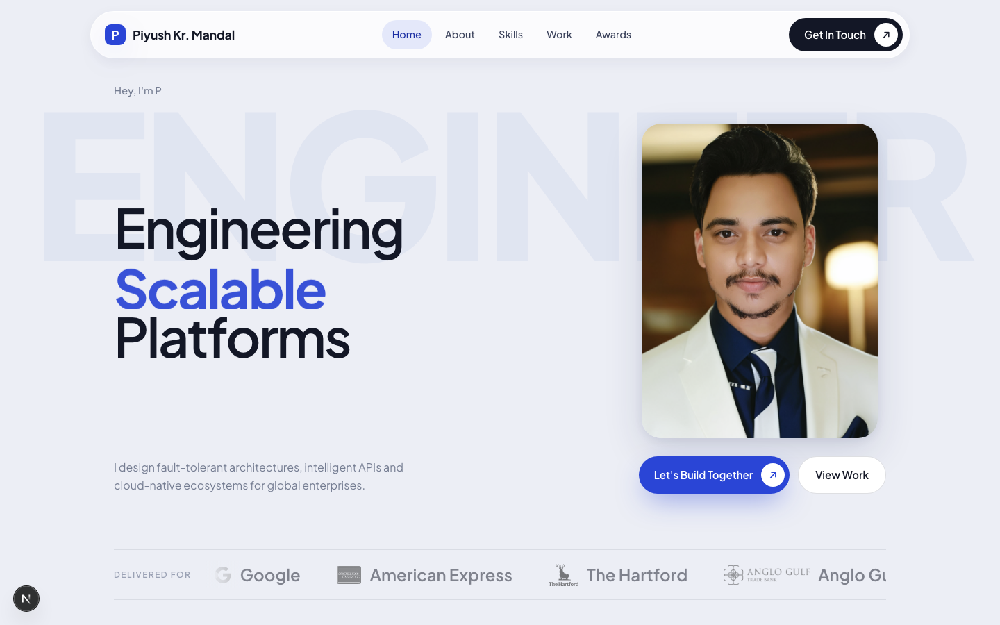

# Piyush Kumar Mandal — Portfolio

A cinematic, scroll-driven personal portfolio built with **Next.js 15**, **Framer Motion**, and **TypeScript**.



---

## About Piyush

Piyush Kumar Mandal is a **Lead Backend Engineer** with over 8 years of experience designing and delivering enterprise-scale distributed systems. He specialises in Java-based microservices architectures, cloud-native platforms, and end-to-end DevOps transformation — with a consistent track record of solving hard infrastructure problems at global financial institutions and technology companies.

He currently works at **EXL Services UK** as Lead Assistant Manager, embedded in the Barclays USA programme (GFED and USCB Cards), where he leads engineering decisions across real-time credit decisioning, platform resilience, and observability.

---

## Career

Piyush has held roles across five organisations, each deepening his command of large-scale backend engineering:

| Period | Company | Role | Client |
|---|---|---|---|
| Aug 2025 — Present | EXL Services UK | Lead Assistant Manager | Barclays USA — GFED, USCB Cards |
| Jun 2022 — Jun 2024 | EXL Services | Senior Software Engineer | Barclays USA — OpenShift & CI/CD |
| Jul 2021 — May 2022 | Cognizant | Associate Projects | Google Trust & Safety Devshop |
| Apr 2021 — Jul 2021 | Alten Calasoft Labs | Java Developer | Anglo Gulf Trade Bank — Corporate Onboarding |
| Oct 2020 — Apr 2021 | Infosys | Senior Systems Engineer | American Express — TPDG |
| Nov 2017 — Sep 2020 | Infosys | Systems Engineer | The Hartford — Ability Advantage |

---

## Key Projects

### Enterprise Credit Decisioning Platform — Barclays USCB Cards
Piyush refactored the microservices and decisioning flows behind Barclays' real-time credit adjudication system (RFT), which combines bureau data from Experian with fraud signals to apply partner-specific credit strategies. The system operates entirely in real-time with end-to-end USCB API integration.

### Cloud-Native Migration to OpenShift V4 — Barclays Platform
He re-platformed a legacy application onto an OpenShift V4 template — highly available, fault-tolerant, and auto-scalable — introducing OAuth as part of the transition. The resulting platform runs 24/7 with elastic scaling under load.

### Intelligent CI/CD Transformation — Barclays DevOps
Piyush led the migration from Stash and Jenkins to GitLab CI/CD, automating cross-environment promotion pipelines. Deployment promotion time dropped from 4 hours to 15 minutes, and delivery speed improved by over 60%.

### Real-Time Monitoring & Observability — Barclays
He built a unified observability layer combining the ELK stack, AppDynamics, Grafana, and Splunk — giving engineering teams live production dashboards and immediate root-cause visibility.

### Google Devshop Automation Ecosystem — Google Trust & Safety
At Cognizant, Piyush built browser extensions and dashboards that automated Google Trust & Safety operations, connecting a JavaScript frontend to a Python backend deployed on GCP App Engine with Cloud SQL.

---

## Technical Skills

| Category | Technologies |
|---|---|
| Languages & Core | Java 8 / 17 / 21, J2EE, Python, JavaScript, SQL, DSA |
| Frameworks | Spring Boot, Spring Cloud, Spring Data JPA, Hibernate, Spring MVC |
| Cloud & Platforms | AWS, GCP, OpenShift V4, App Engine, Docker, Cloud SQL |
| APIs & Messaging | REST / OAS, Microservices, Apache Kafka, RabbitMQ, OAuth, Swagger |
| Data Stores | MySQL, Oracle, MongoDB, Couchbase |
| DevOps & Observability | GitLab CI/CD, Jenkins, ELK, Grafana, AppDynamics, JUnit, Mockito |

---

## Recognition

Piyush has received recognition at every stage of his career:

- **Analytics Oscar Award (2025)** — EXL Northampton. Honoured for excellence in engineering and data-driven delivery on the Barclays programme.
- **Emerging Talent at EXL (2023)** — Awarded for fast impact and technical leadership as a rising engineer within the organisation.
- **Insta Award (2020)** — Infosys Limited. Recognised for outstanding contribution and delivery excellence on enterprise engagements.

---

## What People Say

> *"Piyush designed our transaction processing pipeline to handle peak loads without degradation. His attention to scalability and production readiness made a real difference in our platform reliability."*
> — **Chetan Kumar**, Senior Tech Lead, I-Exceed

> *"Piyush brought structured thinking to our CI/CD pipeline overhaul. He reduced deployment time by identifying root causes, not just symptoms, and built processes our team could own long-term."*
> — **Mandar Namdas**, AVP, Barclays

> *"Piyush's code reviews weren't just about correctness. He coached junior developers on security patterns and system design thinking. We're a stronger team because of his leadership."*
> — **Kishor Marathe**, Project Manager, EXL Services

---

## Portfolio Tech Stack

| Layer | Choice |
|---|---|
| Framework | Next.js 15 (App Router, static export) |
| Language | TypeScript |
| Animation | Framer Motion |
| Fonts | Plus Jakarta Sans (Google Fonts) |
| Styling | CSS Modules + global portfolio.css |
| Icons | Custom inline SVG set |
| Components | shadcn/ui, Magic UI (ShineBorder) |

---

## Running Locally

```bash
npm install
npm run dev
```

Open [http://localhost:3000](http://localhost:3000).

```bash
npm run build   # production build
npm run start   # serve production build locally
```

---

## License

Personal portfolio — all content (name, photo, work history) belongs to Piyush Kumar Mandal. Code structure is open for reference.
